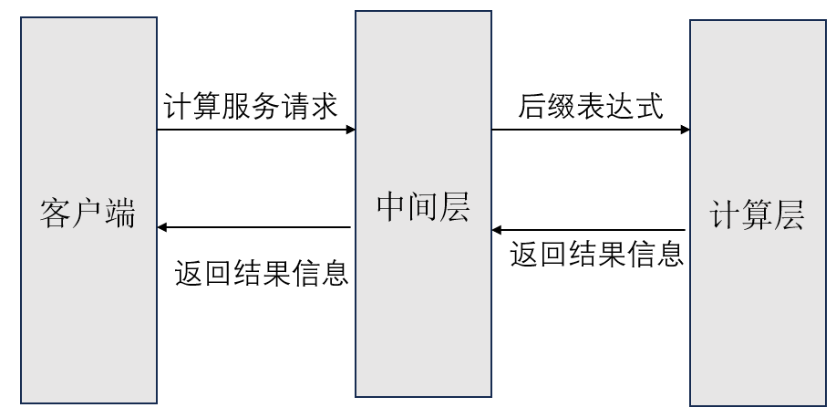
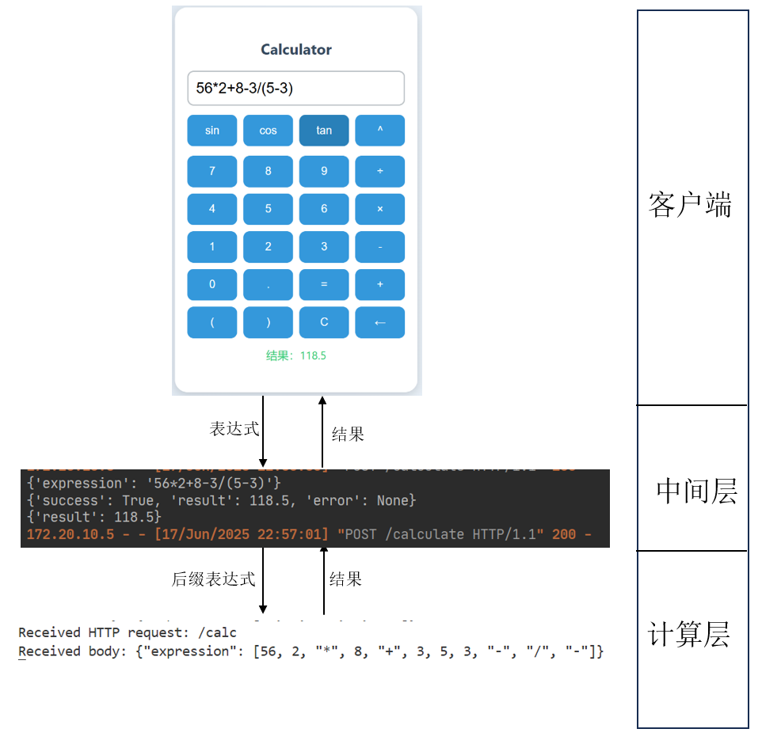
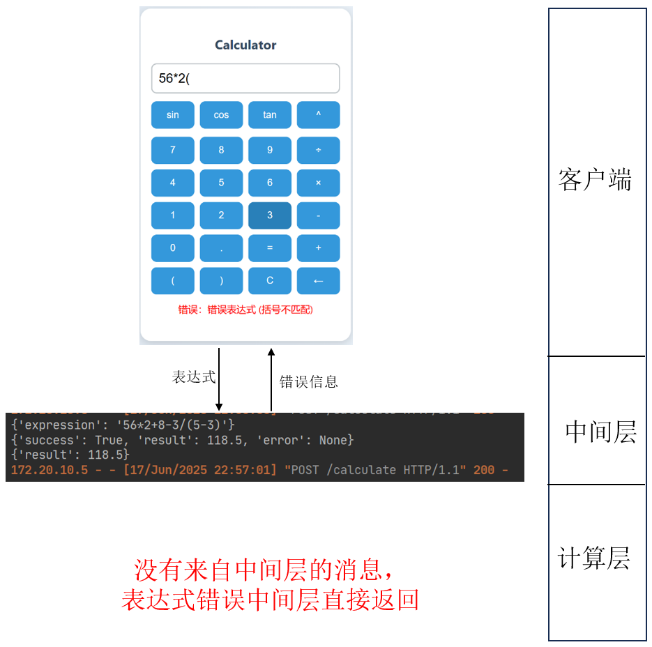

# 现代软件工程小组作业

## 📌 项目简介

本项目为现代软件工程课程的小组作业，设计并实现了一个跨语言、分层架构的计算器系统。系统分为三层：

- **前端客户端**：使用 Java 实现图形用户界面（GUI），负责输入表达式和显示结果；
- **中间控制层**：使用 Python（Flask）完成表达式解析、合法性校验、后缀表达式转换与任务转发；
- **后端计算层**：使用 C 语言完成后缀表达式的高性能计算，支持基础数学运算和部分科学函数。

三者之间通过 **HTTP + JSON** 进行通信，体现了模块解耦、跨语言协作、网络通信与高效计算的综合工程能力。

---

## 🧱 系统框图

---

## ⚙️ 技术栈

| 模块       | 技术 / 工具             | 说明                         |
| ---------- | ----------------------- | ---------------------------- |
| 前端界面   | Java+HTML               | 提供输入与结果展示           |
| 中间控制层 | Python  + Flask         | 实现表达式转化与服务调度     |
| 后端计算层 | C 语言 + HTTP Server    | 快速栈运算，提供本地服务接口 |
| 通信协议   | HTTP + JSON             | 模块之间通信格式统一，易调试 |
| 构建工具   | intellij+pycharm+vscode | 提供代码运行环境             |

---

## 🚀 功能特性

- ✅ 支持中缀表达式输入（如：`sin(30) + 2^3`）
- ✅ 支持运算符：`+ - * / ^`
- ✅ 支持函数：`sin(x), cos(x), sqrt(x)`
- ✅ 表达式校验与错误提示
- ✅ 后缀表达式转换与栈求值
- ✅ 模块解耦、跨语言协作
- ✅ 使用 HTTP 协议通信，便于测试与扩展

---

## 📎 示例

1. 示例1：
	
2. 示例2：
	
3. 示例3：
	
4. 示例4
	

## ⚠️ 注意事项

本项目采用 HTTP 协议进行模块间通信，接口地址需根据实际网络环境进行修改。
