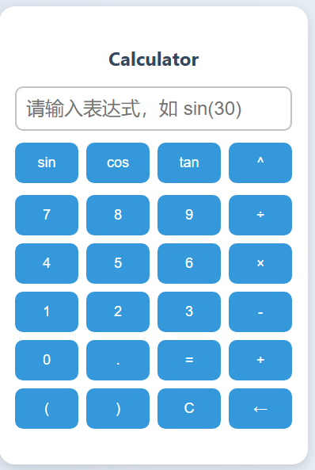

# 📘 接口文档：计算器服务接口

## 🧩 概述

本接口用于计算数学表达式。前端通过发送表达式至后台服务器，后台进行计算并返回结果或错误信息。本接口的主要功能是接收数学表达式并返回计算结果，支持常见的数学函数（如 `sin()`、`cos()`）和基本算术操作。

## 接口概述

### 1. **POST /calculate**

#### 描述：

该接口接收前端传来的数学表达式，进行计算并返回计算结果或错误信息。如果输入的表达式有效，返回计算结果；否则返回错误提示。

#### 请求参数：

- **URL**: `/calculate`
- **方法**: POST
- **Content-Type**: `application/x-www-form-urlencoded`

#### 请求字段：

- **expression**（必填）：用户输入的数学表达式，格式为字符串。例如：`sin(30)`，`5+3`，`10*sqrt(2)`。

#### 请求示例：

```
<form method="post" th:action="@{/calculate}">
    <input type="text" id="expression" name="expression" placeholder="请输入表达式，如 sin(30)" required>
</form>
```

#### 请求流程：

1. 用户在前端界面的输入框中输入数学表达式。
2. 当用户提交表单时，表达式通过POST请求发送到后台 `/calculate` 接口。
3. 后台接收到表达式后，进行相应的计算。
4. 后台将计算结果或错误信息返回前端。

#### 响应格式：

1. **成功响应**：计算成功时返回计算结果。
2. **错误响应**：计算失败时返回错误信息。

##### 成功响应示例：

```
{
  "result": "5.0"
}
```

##### 错误响应示例：

```
{
  "error": "无效的表达式或连接失败"
}
```

#### 处理逻辑：

- 后台根据接收到的表达式进行解析和计算，支持的基本操作包括加法、减法、乘法、除法、括号、幂运算及常见数学函数（如 `sin`, `cos`, `tan`）。
- 如果表达式包含无效的语法（如缺少括号、非法字符等），将返回错误信息。
- 支持的数学函数需通过后台进行函数解析，并在计算后返回结果。

#### 异常处理：

- 如果后台无法连接到相关服务，或输入的表达式无法解析，接口将返回错误信息提示。
- 若表达式计算中出现未捕捉的错误（如除零错误），将返回通用错误信息。

------

## 前端交互流程

1. **表达式输入**：用户通过前端页面输入数学表达式（如 `sin(30)`）。
2. **点击计算**：用户点击 "=" 按钮提交表达式。
   * 注意如果表达式出现括号不匹配的问题，会在中间层转换为后缀表达式的时候检测到，然后接收从中间层发送来的错误信息，进行一个括号不匹配的错误显示
   * 如果是出现除数为0的计算错误，则会在服务器端计算得到，再返回给中间层，中间层转发给网页端。
3. **后台处理**：表达式被发送到 `/calculate` 接口，后台进行计算。
4. **结果展示**：计算结果或错误信息通过响应返回前端，显示在用户界面上。


